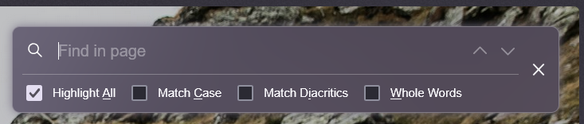
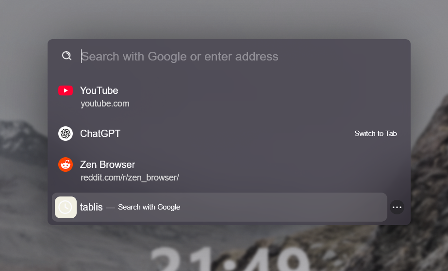
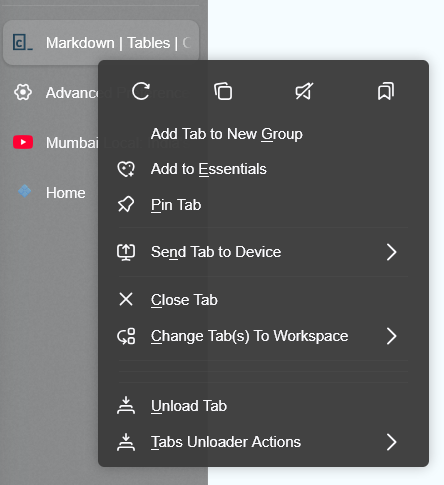
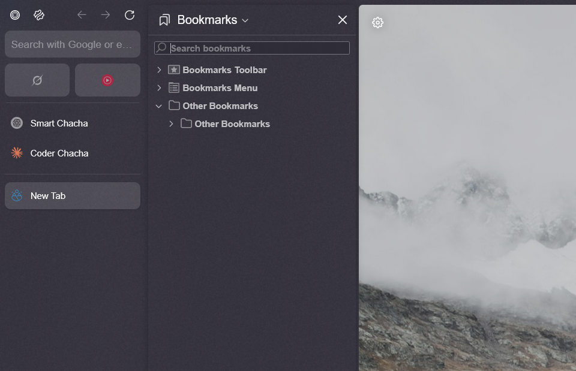

# ZenArc Browser Theme

A minimalist Zen-inspired browser theme focused on clean aesthetics and functionality. Compatible with Twilight 1.8t.

## Overview

ZenArc delivers a modern, distraction-free browsing experience with thoughtfully designed UI elements. The theme emphasizes visual harmony while maintaining full browser functionality.

## Key Features

### Visual Elements
- **Clean, Minimalist Design**: Streamlined interface elements that reduce visual clutter
- **Dynamic Transparency**: Elegant transparency effects throughout the UI (Work in Progress)
- **Blur Effects**: Sophisticated blur on urlbar and expanded sidebar for depth
- **Zen Accent Integration**: Seamlessly follows your chosen Zen accent theme

### Enhanced Components

#### FindBar
A redesigned search experience with improved visibility.  
*Credit: Natsumi*

#### URL Bar
Clean and intuitive address bar design.

#### Context Menu
Streamlined right-click menu interface.

#### Bookmarks
Improved bookmark management and visualization.

### Additional Features
- **Audio Visualizer**: Visual representation of audio playback
- **Custom Icons**: Fresh icon set for a cohesive look
- **Enhanced PDF Viewer**: Improved reading experience for PDF documents

## Installation Guide

1. Navigate to your browser's profiles directory
2. Create a new folder named `chrome`
3. Copy all theme files into the `chrome` folder
4. Restart your browser for changes to take effect

## Required Configuration

1. Access the advanced configuration page
   - Type `about:config` in the address bar
   - Accept the warning message

2. Enable the following settings:

| Name | Value | Meaning |
| ---- | :-----: | ------- |
| Zenarc.audiovisual.enabled	| true	| enables audiovisualiser on tabs|
| Zenarc.contextmenu.enabled	| true	| Enables contextmenu tweaks |
| Zenarc.loadingbar.enabled	| true	| Loading bar |
| Zenarc.sidebar-tweaks.enabled	| true	| All tab/sidebar related tweaks |
| Zenarc.use-windows-accent.enabled | true| Use OS accent as Zen-accent |

## Configs You can / should edit

1. go to 'chrome' folder
2. open 'config.css'
3. edit

## Troubleshooting

### Known Issues
- If transparency effects aren't working, ensure your system supports composition
- For blur-related issues, verify your graphics drivers are up to date

