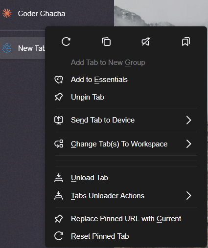
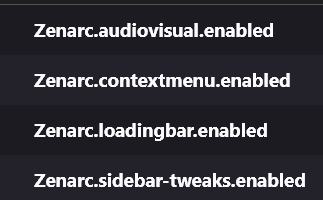

# ZenArc

A Zen theme not inspired by Arc
> Tested on Twilight 1.8t

## Features
- Clean and minimalistic design
- Customizable color schemes
- Transparency All throughout the UI (WIP)

### FindBar

Credit: Natsumi
### Urlbar

### Context Menu

### Bookmarks

### Other stuff
- Audio Visualiser
- New icons
- Blur on urlbar and sidebar expanded
- Follows Zen accent theme
- Better pdf viewer

## Installation
1. Go to profiles folder
2. Make a folder as "chrome"
3. Paste the files into the folder
4. Restart Browser

## Configs
1. Go to about:config
2. Search for these and set to boolean true

